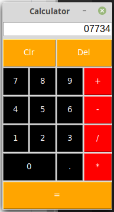

# Charitabl

Calculator in Python using Tkinter.  Because every programmer should make a calculator at least once.

## Authors

- **John Webster** - [RandomHilarity](https://github.com/RandomHilarity)

## Images

